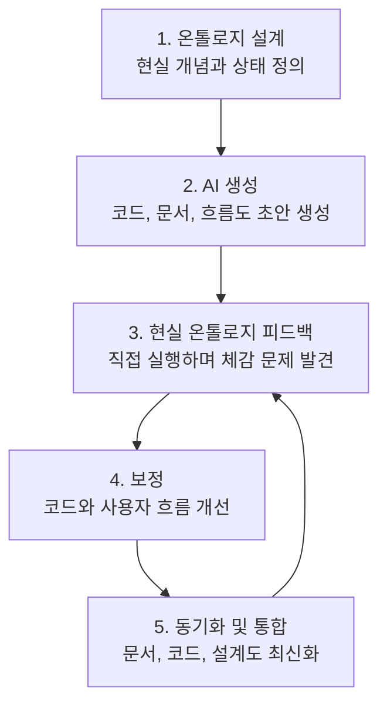

# AI와 함께 개발할 때 배운 점

이 문서는 카페 주문 관리 프로그램을 AI와 함께 만들고 직접 실행해보면서 발견한 중요한 개발 경험을 정리한 것입니다.

단순히 “코드가 돌아간다”에서 끝나는 것이 아니라, 실제 사용자가 프로그램을 어떻게 느끼는지까지 확인해야 한다는 점을 배웠습니다.

---

## 1. AI가 만든 코드도 실행하며 다듬어야 한다

AI가 코드를 만들어도 처음부터 완벽하게 현실 사용 흐름까지 맞추지는 못할 수 있습니다.

이번 프로젝트에서도 기본 구조는 빠르게 만들어졌습니다.

- 클래스 분리
- CRUD
- 컬렉션
- enum
- Stream API
- 예외 처리

이런 문법적/구조적 요구사항은 비교적 잘 반영되었습니다.

하지만 실제로 실행해보니 작은 디테일 문제가 드러났습니다.

- 결제 후 바로 메뉴가 다시 떠서 성공 여부가 잘 보이지 않음
- 매출 조회가 합계만 보여줘서 어떤 주문이 반영됐는지 알기 어려움
- 메뉴 이름과 실제 동작이 완전히 일치하지 않아 헷갈림
- 한글 인코딩 문제로 콘솔 출력이 깨짐

즉, AI가 만든 코드도 반드시 직접 실행하고, 사용자의 눈으로 확인하면서 수정해야 합니다.

---

## 2. 문법 오류보다 운영 디테일 오류가 더 자주 보일 수 있다

AI는 문법 오류나 기본적인 구조 오류를 꽤 잘 줄여줍니다.

하지만 작은 프로그램에서도 실제 운영 디테일은 놓칠 수 있습니다.

예를 들어 코드 내부에서는 주문이 저장되고 매출에 반영되고 있었지만, 화면에서는 사용자가 그것을 바로 알아보기 어려웠습니다.

```text
내부 상태:
주문 저장 완료
매출 계산 가능

사용자 체감:
결제 y를 눌렀는데 그냥 메뉴로 돌아간 것처럼 보임
```

이런 문제는 아키텍처 오류라기보다는 사용자 경험과 운영 흐름의 디테일 문제입니다.

실무에서도 이런 종류의 문제가 많습니다.

- 저장은 됐지만 성공 메시지가 부족함
- 삭제는 됐지만 무엇이 삭제됐는지 알 수 없음
- 결제는 됐지만 매출 반영 여부가 보이지 않음
- 조회 결과가 없는데 아무 메시지도 없음

---

## 3. 현실 세계 온톨로지를 코드에 반영해야 한다

AI에게 “카페 주문 관리 프로그램”이라고 요청하면 `Order`, `Menu`, `Price` 같은 기본 개념은 만들 수 있습니다.

하지만 현실의 카페 주문은 더 많은 의미 단계를 가집니다.

```text
고객
메뉴
수량
포장 여부
할인 정책
결제 예정 금액
결제 확정
주문 접수
제조 중
준비 완료
수령 완료
취소
매출 반영
```

이런 현실 세계의 개념과 관계를 더 분명히 반영해야 프로그램이 자연스럽게 느껴집니다.

이번 프로젝트에서는 다음처럼 보완했습니다.

- `주문 등록`을 `주문 등록 및 결제`로 명확히 변경
- 결제 전 `결제 예정 금액` 출력
- 결제 후 `결제가 완료되었습니다` 메시지 출력
- 주문 저장 후 `[매출 반영] 현재 오늘 매출 합계` 출력
- 매출 조회 시 주문 건수와 반영 주문 목록 출력
- 기능 실행 후 `계속하려면 Enter를 누르세요...`로 결과 확인 시간 제공
- 취소 상태 주문은 매출에서 제외되도록 도메인 규칙 확인
- 주문 상태를 `OrderStatus` enum으로 관리

즉, 단순히 데이터 객체를 만드는 것보다 현실 사건의 흐름을 코드와 화면에 함께 반영하는 것이 중요합니다.

---

## 4. 사용자 interactive 피드백이 중요하다

프로그램 내부에서 처리가 끝났다고 해서 사용자가 그것을 이해하는 것은 아닙니다.

사용자는 내부 변수나 리스트를 볼 수 없습니다.

사용자는 화면에 나타나는 메시지로만 시스템 상태를 판단합니다.

그래서 다음과 같은 피드백이 중요합니다.

```text
결제가 완료되었습니다.
주문이 등록되었습니다.
주문번호는 1번입니다.
매출에 반영되었습니다.
현재 오늘 매출 합계는 5,500원입니다.
계속하려면 Enter를 누르세요.
```

이번 프로젝트에서는 각 기능 실행 후 바로 다음 메뉴로 넘어가지 않도록 `waitForEnter()`를 추가했습니다.

```java
public void waitForEnter(String message) {
    System.out.print(message);
    scanner.nextLine();
}
```

이 개선 덕분에 사용자는 처리 결과를 확인한 뒤 다음 메뉴로 넘어갈 수 있습니다.

이것은 단순한 출력 개선이 아니라, 사용자가 시스템 상태를 이해하게 만드는 중요한 interactive 개선입니다.

---

## 5. AI와 소통할 때는 “체감 문제”를 구체적으로 말해야 한다

AI에게 단순히 “안 돼”라고 말하는 것보다, 사용자가 어떤 흐름에서 무엇을 체감했는지 말하는 것이 훨씬 효과적입니다.

이번 프로젝트에서 효과적이었던 피드백은 이런 식이었습니다.

```text
결제하시겠습니까?에서 y를 눌렀는데 그냥 전체 메뉴로 넘어간다.
9번 오늘 매출 조회를 눌러도 결과가 보이지 않고 메뉴로 돌아가는 것 같다.
메뉴 번호와 실제 기능이 전부 매칭되어야 한다.
```

이런 피드백은 AI가 놓친 현실 흐름을 보완하는 데 도움이 됩니다.

AI는 코드 구조를 빠르게 만들 수 있지만, 실제 사용자가 느끼는 어색함은 사람이 직접 실행하며 발견해야 합니다.

---

## 6. AI 개발 시 체크리스트

AI로 프로그램을 만들 때는 다음을 확인하면 좋습니다.

### 기능 체크

- CRUD가 실제로 모두 동작하는가?
- 등록 후 조회하면 방금 등록한 데이터가 보이는가?
- 수정 후 조회하면 바뀐 값이 보이는가?
- 삭제 후 조회하면 데이터가 사라졌는가?
- 매출이나 합계 같은 계산 결과가 실제 데이터와 맞는가?

### 사용자 흐름 체크

- 메뉴 이름과 실제 동작이 정확히 일치하는가?
- 성공했을 때 성공 메시지가 보이는가?
- 실패했을 때 실패 이유가 보이는가?
- 결과가 너무 빨리 지나가지는 않는가?
- 다음 단계로 넘어가기 전에 사용자가 확인할 시간이 있는가?

### 현실 온톨로지 체크

- 현실에서 존재하는 중요한 개념이 빠지지 않았는가?
- 상태 전이가 자연스러운가?
- 결제, 취소, 매출 반영 같은 사건이 코드와 화면에 표현되는가?
- 사용자가 기대하는 순서대로 흐름이 진행되는가?

### 예외 처리 체크

- 숫자 자리에 문자를 입력해도 프로그램이 종료되지 않는가?
- 없는 번호를 입력했을 때 안내 메시지가 나오는가?
- 빈 값을 입력했을 때 다시 입력받는가?
- 취소나 거절을 선택했을 때 흐름이 자연스러운가?

### 문서 체크

- README의 설명과 실제 메뉴가 일치하는가?
- Mermaid flowchart가 실제 코드 흐름과 맞는가?
- 필수 요구사항이 코드 어디에 들어갔는지 설명되어 있는가?
- 개인 학습용 문서와 제출용 문서가 구분되어 있는가?

---

## 7. 생성된 산출물은 계속 동기화해야 한다

AI와 함께 개발하면 코드, 문서, 설계도, 학습 자료가 빠르게 늘어납니다.

생성 속도가 빠른 만큼 서로 어긋나기도 쉽습니다.

이번 프로젝트에서도 기능이 계속 바뀌면서 이런 동기화 문제가 생길 수 있었습니다.

```text
코드는 최신인데 README는 예전 설명
README는 맞는데 설계 문서는 예전 흐름
기능은 바뀌었는데 Mermaid flowchart는 그대로
원본 프로젝트는 수정됐는데 Virtual Thread 버전은 덜 반영
개인 학습 문서에는 오래된 코드 조각이 남아 있음
```

그래서 AI 개발에서는 약간은 강박적일 정도로 동기화와 통합 확인이 필요합니다.

기능을 바꿨다면 코드만 고치고 끝내면 안 됩니다.

```text
기능 변경
-> 코드 수정
-> 실행 확인
-> README 수정
-> 설계 문서 수정
-> Mermaid flowchart 수정
-> 개인 학습 문서 수정
-> 원본/변형 버전 차이 확인
-> 오래된 표현 검색
-> 최종 실행 확인
```

이번 프로젝트에서는 `주문 등록`이 `주문 등록 및 결제`로 바뀌었고, 매출 반영 메시지와 Enter 대기 기능도 추가되었습니다.

그 결과 코드뿐 아니라 README, 설계 문서, Google Doc 학습 가이드, Virtual Thread 설명서까지 함께 수정해야 했습니다.

이 과정에서 배운 점은 다음과 같습니다.

```text
AI는 빠르게 생성한다.
하지만 생성물이 많아질수록 파편화된다.
개발자는 코드, 문서, 흐름도, 실행 화면을 계속 동기화해야 한다.
동기화되지 않은 문서는 오히려 혼란을 만든다.
```

한 줄로 정리하면:

> AI 개발은 생성 속도가 빠른 만큼, 코드·문서·설계·예시·실행 화면을 계속 동기화하는 통합 감각이 중요하다.

---

## 8. AI 개발 프로세스 모델

이번 프로젝트를 통해 AI와 함께 개발하는 과정을 다음 단계로 정리할 수 있습니다.

```text
1. 온톨로지 설계
2. AI를 통한 생성
3. 현실 온톨로지 피드백
4. 보정
5. 파편화된 산출물 동기화 및 통합
```

### 1단계. 온톨로지 설계

먼저 현실 세계의 개념을 나눕니다.

카페 주문 프로그램에서는 다음 개념들이 필요했습니다.

```text
고객
메뉴
수량
포장 여부
할인 정책
결제 예정 금액
결제 확정
주문 상태
매출 반영
취소
```

이 단계에서 중요한 질문은 다음과 같습니다.

```text
이 프로그램 세계에는 어떤 객체가 있는가?
각 객체는 어떤 상태를 가지는가?
상태는 어떤 순서로 바뀌는가?
어떤 사건이 매출에 반영되는가?
사용자는 어느 순간 어떤 피드백을 기대하는가?
```

### 2단계. AI를 통한 생성

그다음 AI에게 구조와 요구사항을 전달해 코드를 생성합니다.

AI는 다음 작업을 빠르게 도와줍니다.

```text
클래스 생성
CRUD 구현
컬렉션 처리
enum 작성
Stream API 검색/필터
예외 처리
문서 초안 작성
Mermaid flowchart 생성
```

이 단계의 장점은 속도입니다.

하지만 생성된 결과가 현실 사용 흐름까지 완벽히 반영한다고 가정하면 안 됩니다.

### 3단계. 현실 온톨로지 피드백

생성된 프로그램을 직접 실행하면서 현실 흐름과 맞는지 확인합니다.

이번 프로젝트에서는 실행 중 이런 피드백이 나왔습니다.

```text
결제했는데 매출에 반영된 느낌이 약하다.
메뉴 번호와 실제 기능이 명확히 매칭되어야 한다.
결과가 바로 다음 메뉴에 묻힌다.
9번 매출 조회에서 어떤 주문이 반영됐는지 보이지 않는다.
취소 주문은 매출에서 빠져야 한다.
```

이 피드백은 단순 버그 리포트가 아니라, 현실 온톨로지를 프로그램에 더 정확히 반영하게 만드는 과정입니다.

### 4단계. 보정

피드백을 바탕으로 코드와 사용자 흐름을 보정합니다.

이번 프로젝트에서는 다음 보정이 있었습니다.

```text
1번 메뉴를 주문 등록 및 결제로 변경
결제 예정 금액 출력
결제 완료 메시지 추가
주문 저장 직후 매출 반영 메시지 추가
9번 매출 조회에 주문 수와 주문 목록 추가
각 기능 후 Enter 대기 추가
취소 주문 매출 제외 확인
```

이 단계는 AI가 생성한 코드를 현실 사용 흐름에 맞게 다듬는 과정입니다.

### 5단계. 파편화된 산출물 동기화 및 통합

보정이 끝나면 코드만 바뀌어서는 안 됩니다.

관련 산출물도 모두 같이 맞춰야 합니다.

```text
코드
README
설계 문서
Mermaid flowchart
학습 가이드
Virtual Thread 설명서
회고 문서
실행 화면
```

이 단계가 빠지면 프로젝트가 파편화됩니다.

```text
코드는 최신인데 문서는 예전 흐름
문서는 맞는데 flowchart가 틀림
원본은 수정됐는데 변형 버전은 누락
학습 자료에는 옛날 코드 조각이 남음
```

AI 개발에서는 생성 속도가 빠르기 때문에, 마지막 동기화와 통합 단계가 특히 중요합니다.

### 프로세스 요약



이 프로세스는 한 번으로 끝나지 않습니다.

동기화 후 다시 실행해보고, 또 현실 피드백을 받아 보정합니다.

한 줄로 정리하면:

> AI 개발은 온톨로지를 설계하고, AI로 생성하고, 현실 피드백으로 보정한 뒤, 파편화된 산출물을 다시 동기화하는 반복 과정이다.

---

## 9. 최종 정리

AI 개발에서 중요한 것은 단순히 코드를 빠르게 만드는 것이 아닙니다.

AI가 만든 코드를 실제로 실행해보고, 현실 사용 흐름과 맞지 않는 작은 디테일을 계속 보완해야 합니다.

이번 프로젝트를 통해 배운 핵심은 다음과 같습니다.

```text
AI는 기본 구조와 문법 구현을 빠르게 도와준다.
하지만 현실 세계의 세부 흐름은 사람이 직접 실행하며 점검해야 한다.
사용자가 체감할 수 있는 피드백이 필요하다.
메뉴, 메시지, 상태, 매출 반영 같은 작은 디테일이 프로그램의 완성도를 크게 좌우한다.
AI와 잘 협업하려면 체감 문제를 구체적으로 설명해야 한다.
```

한 줄로 요약하면:

> AI 개발의 핵심은 코드를 생성하는 것에서 끝나지 않고, 현실 세계의 의미와 사용자 체감을 반영하도록 계속 대화하며 다듬는 것이다.
