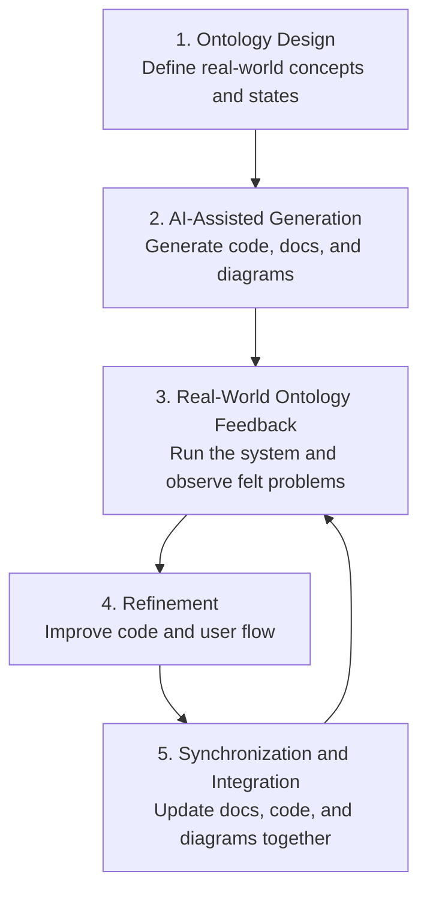

# Lessons Learned from AI-Assisted Development

This document summarizes the practical lessons I learned while building and testing a cafe order management program with AI assistance.

The key lesson was that software development does not end when the code simply runs. A developer must also verify whether the program matches real user behavior, business flow, and operational details.

---

## 1. AI-Generated Code Still Needs Real Execution and Refinement

AI can generate a working structure very quickly.

In this project, AI helped implement the main programming requirements:

- class separation
- CRUD features
- collections
- enum
- Stream API
- exception handling

These syntax-level and architecture-level requirements were implemented relatively well.

However, when I actually ran the program, several small but important usability issues appeared:

- after payment, the menu returned too quickly, so it was hard to notice whether the order had been saved
- the daily sales screen only showed the total amount, so it was unclear which orders were included
- some menu labels did not fully match the actual behavior
- Korean text encoding was broken in the Windows console

This taught me that AI-generated code must be executed, observed, and refined from the user's perspective.

---

## 2. Operational Detail Issues Can Be More Common Than Syntax Errors

AI is often good at reducing syntax errors and basic structural mistakes.

However, even in a small program, it can miss small operational details.

For example, internally the order was saved and sales could be calculated. But from the user's perspective, that result was not clearly visible.

```text
Internal state:
Order saved
Sales calculable

User experience:
I pressed y to pay, but it looked like the program simply returned to the main menu
```

This was not a major architecture failure. It was a usability and operational flow issue.

In real work, many defects are like this:

- data is saved, but the success message is unclear
- data is deleted, but the user cannot tell what was deleted
- payment is completed, but sales reflection is not visible
- a search result is empty, but no message is shown

---

## 3. Real-World Ontology Must Be Reflected in Code

If I ask AI to create a cafe order management system, it can easily create basic concepts such as `Order`, `Menu`, and `Price`.

But a real cafe order has more meaningful stages:

```text
customer
menu item
quantity
takeout option
discount policy
expected payment amount
payment confirmation
order received
making
ready
completed
canceled
sales reflection
```

These real-world concepts and relationships need to be represented clearly in both the code and the user interface.

In this project, I refined the program by adding or clarifying the following:

- changed `Create Order` into `Create Order and Payment`
- displayed the expected payment amount before confirmation
- displayed a payment completion message
- displayed the current daily sales total right after saving an order
- displayed sales order count and included order details in the daily sales screen
- added an `Enter` pause after each feature so the user could read the result
- confirmed that canceled orders are excluded from sales
- managed order status with the `OrderStatus` enum

The lesson is that a program should not only contain data objects. It should also represent real-world events, states, and transitions.

---

## 4. Interactive User Feedback Is Critical

Even if the program finishes processing internally, the user cannot understand the result unless the system communicates it clearly.

Users cannot see internal variables or lists.

They understand the system state through messages shown on the screen.

Good feedback looks like this:

```text
Payment completed.
Order saved.
Order number: 1
Sales reflected.
Current daily sales total: 5,500 won
Press Enter to continue.
```

In this project, I added `waitForEnter()` so that the program would not immediately jump back to the main menu.

```java
public void waitForEnter(String message) {
    System.out.print(message);
    scanner.nextLine();
}
```

This improvement allowed the user to confirm the result before moving to the next action.

This is not just a display improvement. It is an important interactive design improvement that helps the user understand the system state.

---

## 5. When Working with AI, Describe the Felt Problem Clearly

When collaborating with AI, saying “it does not work” is often not enough.

It is much more effective to describe what happened, where it happened, and how it felt from the user's perspective.

Useful feedback from this project included:

```text
When I press y at the payment confirmation, it just returns to the main menu.
When I press option 9 for daily sales, I cannot see the result clearly.
The menu numbers and actual features should match exactly.
```

This kind of feedback helps AI identify the missing real-world flow.

AI can generate code structure quickly, but the user must still run the program and notice where the experience feels unnatural.

---

## 6. AI Development Checklist

When developing software with AI, I should check the following points.

### Feature Checklist

- Does CRUD actually work?
- After creating data, can I find it through read/search?
- After updating data, does the changed value appear correctly?
- After deleting data, is it really gone?
- Are calculated values such as sales totals correct?

### User Flow Checklist

- Do menu labels match the actual behavior?
- Is a success message shown after successful processing?
- Is an error reason shown after failure?
- Does the result disappear too quickly?
- Does the user have enough time to confirm the result before the next step?

### Real-World Ontology Checklist

- Are important real-world concepts missing?
- Are state transitions natural?
- Are events such as payment, cancellation, and sales reflection represented in code and UI?
- Does the program follow the order of actions that users expect?

### Exception Handling Checklist

- Does the program continue when the user types letters instead of numbers?
- Does the program show a message when a non-existing number is entered?
- Does the program ask again when an empty value is entered?
- Does the flow remain natural when the user cancels or refuses confirmation?

### Documentation Checklist

- Does the README match the actual menu?
- Does the Mermaid flowchart match the current code flow?
- Are the required assignment features mapped to actual code?
- Are personal study notes separated from submission documents?

---

## 7. Generated Artifacts Must Be Continuously Synchronized

When developing with AI, code, documentation, diagrams, and study materials can grow very quickly.

Because generation is fast, artifacts can easily become inconsistent.

In this project, the feature flow changed several times, which could have created synchronization issues:

```text
The code is updated, but the README still describes the old behavior
The README is correct, but the design document is outdated
The feature changed, but the Mermaid flowchart is unchanged
The base version is fixed, but the Virtual Thread version is not
The study guide still contains old code examples
```

This taught me that AI-assisted development requires an almost obsessive level of synchronization and integration.

After changing a feature, I should not stop at code modification.

```text
Feature change
-> code update
-> execution test
-> README update
-> design document update
-> Mermaid flowchart update
-> personal study guide update
-> base/variant version comparison
-> search for outdated expressions
-> final execution check
```

In this project, `Create Order` evolved into `Create Order and Payment`, and sales reflection messages and Enter pauses were added.

Therefore, the code, README, design documents, Google Doc study guide, and Virtual Thread guide all needed to be updated together.

The lesson is:

```text
AI generates quickly.
But the more artifacts are generated, the easier they fragment.
The developer must keep code, documentation, diagrams, and examples synchronized.
Unsynchronized documentation creates confusion instead of clarity.
```

In one sentence:

> AI-assisted development requires not only fast generation, but also strong integration discipline across code, documentation, diagrams, examples, and execution behavior.

---

## 8. AI Development Process Model

Through this project, I can define the AI-assisted development process in five stages:

```text
1. Ontology design
2. AI-assisted generation
3. Real-world ontology feedback
4. Refinement
5. Synchronization and integration of fragmented artifacts
```

### Stage 1. Ontology Design

First, I define the real-world concepts of the system.

For a cafe order system, the following concepts were necessary:

```text
customer
menu item
quantity
takeout option
discount policy
expected payment amount
payment confirmation
order status
sales reflection
cancellation
```

Important questions at this stage are:

```text
What objects exist in this program world?
What states does each object have?
In what order do the states change?
Which events affect sales?
At which moments does the user expect feedback?
```

### Stage 2. AI-Assisted Generation

Then I communicate the structure and requirements to AI and generate the first implementation.

AI can quickly help with:

```text
class creation
CRUD implementation
collection management
enum design
Stream API search/filter logic
exception handling
documentation draft
Mermaid flowchart creation
```

The strength of this stage is speed.

However, I should not assume that generated code perfectly reflects real usage flow.

### Stage 3. Real-World Ontology Feedback

Next, I execute the generated program and compare it with the real-world flow.

In this project, execution revealed feedback such as:

```text
The payment seemed completed, but sales reflection was not clearly visible.
Menu numbers and actual functions must match clearly.
The result was buried by the next menu too quickly.
The daily sales screen did not show which orders were included.
Canceled orders should be excluded from sales.
```

This feedback is more than bug reporting.

It is the process of correcting the program so that it better reflects the real-world ontology.

### Stage 4. Refinement

Based on feedback, I refine both the code and the user flow.

In this project, refinement included:

```text
renaming option 1 to Create Order and Payment
displaying the expected payment amount
adding a payment completion message
showing sales reflection immediately after saving an order
showing sales order count and included order details in option 9
adding an Enter pause after each feature
confirming that canceled orders are excluded from sales
```

This stage turns AI-generated code into a program that fits real user behavior.

### Stage 5. Synchronization and Integration of Fragmented Artifacts

After refinement, I must update more than just the code.

All related artifacts should be synchronized:

```text
code
README
design document
Mermaid flowchart
study guide
Virtual Thread guide
retrospective document
execution screen
```

Without this stage, the project becomes fragmented.

```text
The code is current, but the documentation describes an old flow
The document is correct, but the flowchart is wrong
The base version is fixed, but the variant version is missing the change
The study material still contains outdated code snippets
```

Because AI can generate many artifacts very quickly, final synchronization and integration become especially important.

### Process Summary



This process is iterative.

After synchronization, I run the program again, collect more real-world feedback, and refine it again.

In one sentence:

> AI-assisted development is an iterative process of designing ontology, generating with AI, correcting through real-world feedback, and synchronizing fragmented artifacts into one coherent product.

---

## 9. Final Summary

The most important lesson is that AI-assisted development is not just about generating code quickly.

I need to run the program, observe real behavior, and continuously refine small details that affect the user experience.

The core lessons from this project are:

```text
AI can quickly help with structure and syntax.
But real-world details must be verified by a human through execution.
Users need visible feedback to understand the system state.
Small details such as menus, messages, status, and sales reflection greatly affect product quality.
To collaborate well with AI, I need to describe concrete user-facing problems.
```

In one sentence:

> The core of AI-assisted development is not simply code generation, but continuous collaboration that aligns code with real-world meaning and user experience.
