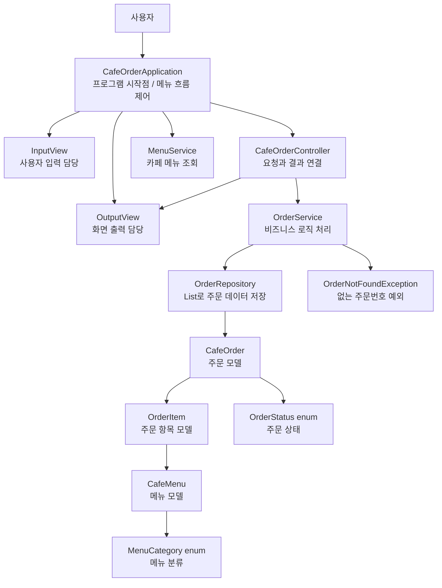
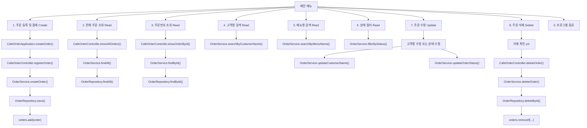
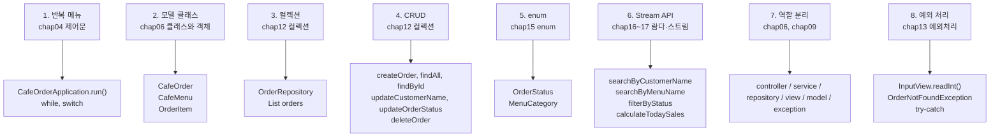
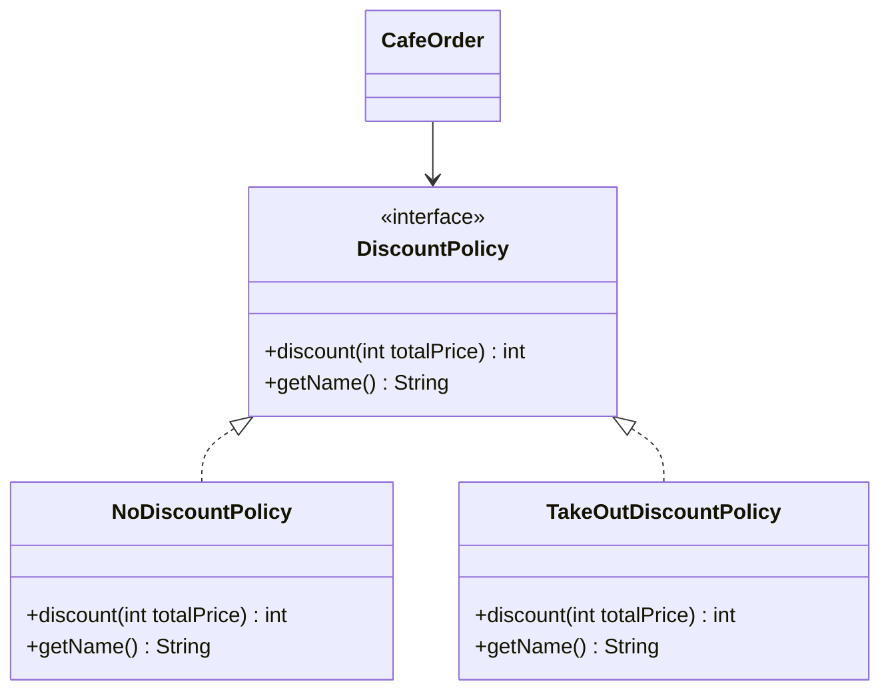
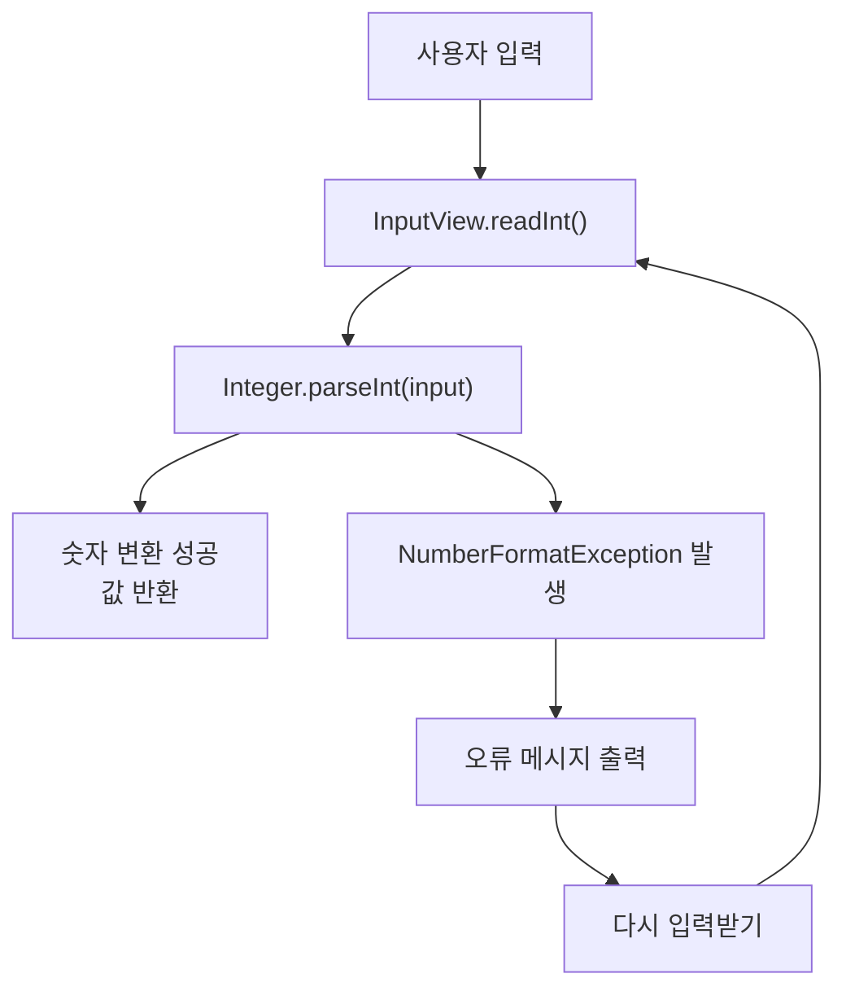

# 카페 주문 관리 프로그램 설계 해설

이 문서는 `cafe-order-management-system` 프로젝트가 어떤 구조로 설계되었고, 과제 필수 요구사항 1~8번이 코드 어디에 반영되어 있는지 설명합니다.

주제는 **카페 주문 관리 프로그램**입니다. 사용자는 콘솔 메뉴에서 주문을 등록하고, 조회하고, 수정하고, 삭제할 수 있습니다.

## 1. 전체 프로그램 구조



### 초보자용 설명

이 프로그램은 한 클래스에 모든 코드를 몰아넣지 않았습니다.

각 클래스가 맡은 역할이 다릅니다.

- `CafeOrderApplication`: 메뉴를 보여주고 사용자가 선택한 기능을 실행합니다.
- `InputView`: 숫자, 문자열, y/n 같은 사용자 입력을 받습니다.
- `OutputView`: 메뉴, 주문 목록, 오류 메시지를 출력합니다.
- `CafeOrderController`: 사용자의 요청을 서비스에 전달하고 결과를 화면에 보여줍니다.
- `OrderService`: 주문 등록, 검색, 수정, 삭제 같은 실제 업무 규칙을 처리합니다.
- `OrderRepository`: 주문 데이터를 `List<CafeOrder>`에 저장하고 찾습니다.
- `model` 클래스들: 주문, 메뉴, 주문 항목 같은 데이터를 표현합니다.

이렇게 나누는 것을 **관심사의 분리**라고 합니다.

## 2. CRUD 흐름도

CRUD는 데이터를 다루는 기본 기능입니다.

- Create: 등록
- Read: 조회
- Update: 수정
- Delete: 삭제



## 3. CRUD가 코드에 구현된 위치

### Create: 주문 등록 및 결제

시작 위치:

```java
// CafeOrderApplication.java
case 1 -> createOrder();
```

실제 흐름:

```java
private void createOrder() {
    String customerName = inputView.readLine("고객명: ");
    List<OrderItem> items = readOrderItems();
    DiscountPolicy discountPolicy = readDiscountPolicy();

    int originalPrice = items.stream()
            .mapToInt(OrderItem::getSubtotal)
            .sum();
    int finalPrice = originalPrice - discountPolicy.discount(originalPrice);

    outputView.printMessage("결제 예정 금액: " + String.format("%,d원", finalPrice));

    if (!inputView.readYesNo("결제하시겠습니까?")) {
        outputView.printMessage("결제가 취소되어 주문을 등록하지 않습니다.");
        return;
    }

    outputView.printMessage("결제가 완료되었습니다. 주문을 저장합니다.");
    cafeOrderController.registerOrder(customerName, items, discountPolicy);
}
```

그 다음 `CafeOrderController`가 `OrderService`로 넘깁니다.

```java
// CafeOrderController.java
public void registerOrder(String customerName, List<OrderItem> items, DiscountPolicy discountPolicy) {
    CafeOrder order = orderService.createOrder(customerName, items, discountPolicy);
    outputView.printMessage("[완료] 주문이 등록되었습니다.");
    outputView.printOrder(order);
    outputView.printMessage("[매출 반영] 현재 오늘 매출 합계: "
            + String.format("%,d원", orderService.calculateTodaySales()));
}
```

실제 주문 객체 생성과 저장은 `OrderService`에서 합니다.

```java
// OrderService.java
public CafeOrder createOrder(String customerName, List<OrderItem> items, DiscountPolicy discountPolicy) {
    validateCustomerName(customerName);

    if (items == null || items.isEmpty()) {
        throw new IllegalArgumentException("주문 항목은 1개 이상 필요합니다.");
    }

    CafeOrder order = new CafeOrder(orderRepository.nextOrderId(), customerName.trim(), items, discountPolicy);
    return orderRepository.save(order);
}
```

마지막으로 `OrderRepository`의 `List`에 저장됩니다.

```java
// OrderRepository.java
public CafeOrder save(CafeOrder order) {
    orders.add(order);
    return order;
}
```

초보자용 설명:

결제 확인에서 `y`를 눌러야 `new CafeOrder(...)`로 주문 객체를 만들고, `orders.add(order)`로 리스트에 넣습니다. 저장 직후에는 `[매출 반영]` 메시지로 현재 매출 합계도 바로 보여줍니다. 이것이 등록, 즉 Create입니다.

### Read: 주문 조회

Read는 여러 종류가 있습니다.

전체 조회:

```java
case 2 -> cafeOrderController.showAllOrders();
```

주문번호 조회:

```java
case 3 -> findOrderById();
```

고객명 검색:

```java
case 4 -> searchByCustomerName();
```

메뉴명 검색:

```java
case 5 -> searchByMenuName();
```

상태 필터:

```java
case 6 -> filterByStatus();
```

전체 조회의 실제 저장소 코드:

```java
// OrderRepository.java
public List<CafeOrder> findAll() {
    return orders.stream()
            .sorted(Comparator.comparing(CafeOrder::getId))
            .toList();
}
```

주문번호 조회:

```java
// OrderRepository.java
public CafeOrder findById(int id) {
    return orders.stream()
            .filter(order -> order.getId() == id)
            .findFirst()
            .orElse(null);
}
```

초보자용 설명:

Read는 리스트에 들어 있는 주문을 꺼내 보는 기능입니다. 전체를 볼 수도 있고, 주문번호나 고객명 같은 조건으로 찾을 수도 있습니다.

### Update: 주문 수정

시작 위치:

```java
case 7 -> updateOrder();
```

수정 메뉴:

```java
private void updateOrder() {
    outputView.printUpdateMenu();
    int updateMenu = inputView.readInt("수정 메뉴 선택: ");
    int id = inputView.readInt("수정할 주문번호: ");

    switch (updateMenu) {
        case 1 -> {
            String customerName = inputView.readLine("새 고객명: ");
            cafeOrderController.updateCustomerName(id, customerName);
        }
        case 2 -> {
            OrderStatus status = readOrderStatus();
            cafeOrderController.updateOrderStatus(id, status);
        }
        default -> outputView.printError("수정 메뉴는 1 또는 2만 선택할 수 있습니다.");
    }
}
```

고객명 수정:

```java
// OrderService.java
public void updateCustomerName(int id, String customerName) {
    validateCustomerName(customerName);
    CafeOrder order = findById(id);
    order.changeCustomerName(customerName);
}
```

주문 상태 수정:

```java
// OrderService.java
public void updateOrderStatus(int id, OrderStatus status) {
    CafeOrder order = findById(id);
    order.changeStatus(status);
}
```

초보자용 설명:

Update는 이미 리스트에 들어 있는 주문 객체를 찾은 뒤, 그 객체의 값을 바꾸는 기능입니다. 이 프로그램에서는 고객명과 주문 상태를 수정할 수 있습니다.

### Delete: 주문 삭제

시작 위치:

```java
case 8 -> deleteOrder();
```

삭제 전 확인:

```java
private void deleteOrder() {
    int id = inputView.readInt("삭제할 주문번호: ");
    boolean confirmed = inputView.readYesNo("정말 삭제하시겠습니까?");

    if (!confirmed) {
        outputView.printMessage("삭제를 취소했습니다.");
        return;
    }

    cafeOrderController.deleteOrder(id);
}
```

실제 삭제:

```java
// OrderRepository.java
public boolean deleteById(int id) {
    return orders.removeIf(order -> order.getId() == id);
}
```

초보자용 설명:

Delete는 리스트에서 데이터를 제거하는 기능입니다. `removeIf`는 조건에 맞는 데이터를 찾아서 삭제합니다. 여기서는 주문번호가 같은 주문을 삭제합니다.

### Sales: 오늘 매출 조회

9번 메뉴는 매출 합계만 보여주지 않고, 매출에 반영된 주문 목록도 함께 보여줍니다.

```java
public void showTodaySales() {
    List<CafeOrder> salesOrders = orderService.findSalesOrders();
    outputView.printSalesSummary(salesOrders, orderService.calculateTodaySales());
}
```

취소된 주문은 매출에서 제외합니다.

```java
public List<CafeOrder> findSalesOrders() {
    return orderRepository.findAll().stream()
            .filter(order -> order.getStatus() != OrderStatus.CANCELED)
            .toList();
}
```

초보자용 설명:

매출은 단순히 모든 주문의 합계가 아닙니다. 현실에서는 취소된 주문은 매출에서 제외해야 합니다. 그래서 `OrderStatus.CANCELED`가 아닌 주문만 골라 합계를 계산합니다.

### 결과 확인 후 Enter 대기

각 메뉴 기능이 끝나면 바로 다음 메뉴를 출력하지 않고, 사용자가 결과를 읽을 수 있도록 Enter 입력을 기다립니다.

```java
if (running) {
    inputView.waitForEnter("계속하려면 Enter를 누르세요...");
}
```

이 코드는 결과 메시지가 메뉴에 묻히지 않도록 해주는 사용자 interactive 개선입니다.

## 4. 필수 요구사항 1~8번 반영 위치



## 5. 필수 요구사항별 코딩 풀이

### 요구사항 1. 콘솔 메뉴 반복과 정상 종료

관련 파일:

- `CafeOrderApplication.java`

핵심 코드:

```java
boolean running = true;

while (running) {
    outputView.printMainMenu();
    int menu = inputView.readInt("메뉴 선택: ");

    switch (menu) {
        case 1 -> createOrder();
        case 0 -> running = false;
        default -> outputView.printError("메뉴 번호는 0부터 9까지 입력해주세요.");
    }
}
```

초보자용 설명:

`while`은 반복문입니다. `running`이 `true`이면 메뉴가 계속 나옵니다. 사용자가 `0`을 입력하면 `running = false`가 되어 반복이 끝납니다.

이 부분이 chap04 제어문에 해당합니다.

### 요구사항 2. 모델 클래스

관련 파일:

- `CafeOrder.java`
- `CafeMenu.java`
- `OrderItem.java`

핵심 코드:

```java
public class CafeOrder {
    private final int id;
    private String customerName;
    private final List<OrderItem> items;
    private OrderStatus status;

    public int getId() {
        return id;
    }

    public void changeCustomerName(String customerName) {
        this.customerName = customerName.trim();
    }
}
```

초보자용 설명:

모델 클래스는 데이터를 표현하는 클래스입니다. `CafeOrder`는 주문 한 건을 표현합니다.

필드를 `private`으로 만든 이유는 외부에서 값을 마음대로 바꾸지 못하게 하기 위해서입니다. 대신 `getId()`, `changeCustomerName()` 같은 메소드를 통해 접근합니다.

이 부분이 chap06 클래스와 객체에 해당합니다.

### 요구사항 3. 컬렉션으로 여러 데이터 관리

관련 파일:

- `OrderRepository.java`

핵심 코드:

```java
private final List<CafeOrder> orders = new ArrayList<>();
```

초보자용 설명:

주문은 한 건만 있는 것이 아니라 여러 건이 쌓입니다. 그래서 여러 데이터를 담을 수 있는 `List`를 사용합니다.

`orders` 리스트는 주문 객체들을 저장하는 작은 데이터베이스 역할을 합니다.

이 부분이 chap12 컬렉션에 해당합니다.

### 요구사항 4. CRUD

관련 파일:

- `CafeOrderApplication.java`
- `CafeOrderController.java`
- `OrderService.java`
- `OrderRepository.java`

CRUD 정리:

| 기능 | 메뉴 | 주요 메소드 |
| --- | --- | --- |
| Create | 1. 주문 등록 및 결제 | `OrderService.createOrder()`, `OrderRepository.save()` |
| Read | 2~6. 조회/검색/필터 | `findAll()`, `findById()`, `searchByCustomerName()`, `searchByMenuName()`, `filterByStatus()` |
| Update | 7. 주문 수정 | `updateCustomerName()`, `updateOrderStatus()` |
| Delete | 8. 주문 삭제 | `deleteOrder()`, `deleteById()` |

초보자용 설명:

CRUD는 데이터 관리 프로그램의 기본입니다.

카페 주문 관리 프로그램에서는 주문을 만들고, 보고, 고치고, 지울 수 있어야 합니다.

### 요구사항 5. enum 사용

관련 파일:

- `OrderStatus.java`
- `MenuCategory.java`

핵심 코드:

```java
public enum OrderStatus {
    WAITING("접수 대기"),
    MAKING("제조 중"),
    READY("준비 완료"),
    COMPLETED("수령 완료"),
    CANCELED("취소");
}
```

초보자용 설명:

`enum`은 정해진 값 중 하나만 선택하게 만들 때 사용합니다.

주문 상태를 그냥 문자열로 관리하면 `"제조중"`, `"제조 중"`, `"making"`처럼 값이 제각각 될 수 있습니다. enum을 사용하면 `WAITING`, `MAKING`, `READY`처럼 정해진 값만 사용할 수 있습니다.

이 부분이 chap15 enum에 해당합니다.

### 요구사항 6. Stream API 검색·필터 2개 이상

관련 파일:

- `OrderService.java`
- `CafeOrder.java`
- `OrderRepository.java`

고객명 검색:

```java
public List<CafeOrder> searchByCustomerName(String keyword) {
    return orderRepository.findAll().stream()
            .filter(order -> order.getCustomerName().toLowerCase().contains(keyword.toLowerCase()))
            .toList();
}
```

메뉴명 검색:

```java
public List<CafeOrder> searchByMenuName(String keyword) {
    return orderRepository.findAll().stream()
            .filter(order -> order.containsMenuName(keyword))
            .toList();
}
```

상태 필터:

```java
public List<CafeOrder> filterByStatus(OrderStatus status) {
    return orderRepository.findAll().stream()
            .filter(order -> order.getStatus() == status)
            .toList();
}
```

초보자용 설명:

Stream API는 리스트에서 원하는 데이터만 골라낼 때 유용합니다.

흐름은 보통 이렇습니다.

```text
리스트.stream()
-> filter로 조건 검사
-> toList로 다시 리스트로 모으기
```

이 부분이 chap16 람다와 chap17 스트림에 해당합니다.

### 요구사항 7. 역할별 클래스 분리

관련 패키지:

```text
com.assignment.cafe
├─ controller
├─ exception
├─ model
├─ repository
├─ service
└─ view
```

역할 설명:

| 패키지 | 역할 |
| --- | --- |
| `view` | 사용자 입력과 화면 출력 |
| `controller` | 사용자 요청을 받아 service에 전달 |
| `service` | 비즈니스 로직 처리 |
| `repository` | 컬렉션에 데이터 저장/조회/삭제 |
| `model` | 데이터 표현 |
| `exception` | 예외 클래스 |

초보자용 설명:

한 파일에 모든 코드를 넣으면 처음에는 쉬워 보이지만, 기능이 늘어나면 어디를 고쳐야 하는지 알기 어렵습니다.

그래서 화면, 로직, 데이터 저장, 모델을 나누었습니다.

이 부분이 chap06 클래스와 객체, chap09 다형성과 연결됩니다.

### 요구사항 8. 잘못된 입력에도 종료되지 않기

관련 파일:

- `InputView.java`
- `CafeOrderApplication.java`
- `CafeOrderController.java`
- `OrderNotFoundException.java`

숫자 입력 예외 처리:

```java
public int readInt(String message) {
    while (true) {
        System.out.print(message);
        String input = scanner.nextLine();

        try {
            return Integer.parseInt(input.trim());
        } catch (NumberFormatException e) {
            System.out.println("[입력 오류] 숫자를 입력해주세요.");
        }
    }
}
```

없는 주문번호 예외:

```java
public CafeOrder findById(int id) {
    CafeOrder order = orderRepository.findById(id);

    if (order == null) {
        throw new OrderNotFoundException(id);
    }

    return order;
}
```

초보자용 설명:

사용자가 숫자를 입력해야 하는 곳에 `abc`를 입력하면 `Integer.parseInt()`에서 예외가 발생합니다.

이때 예외를 처리하지 않으면 프로그램이 바로 종료됩니다. 하지만 `try-catch`로 예외를 잡으면 오류 메시지만 보여주고 다시 입력받을 수 있습니다.

이 부분이 chap13 예외처리에 해당합니다.

## 6. 다형성 추가 설명

이 과제의 요구사항 표에는 직접 “다형성”이 번호로 들어가 있지는 않지만, 7번 관련 챕터에 chap09가 포함되어 있습니다.

이 프로젝트에서는 할인 정책을 다형성 예시로 넣었습니다.



코드:

```java
private DiscountPolicy readDiscountPolicy() {
    boolean takeOut = inputView.readYesNo("포장 주문입니까?");

    if (takeOut) {
        return new TakeOutDiscountPolicy();
    }

    return new NoDiscountPolicy();
}
```

초보자용 설명:

`DiscountPolicy`는 할인 정책의 공통 약속입니다.

- 매장 주문이면 `NoDiscountPolicy`
- 포장 주문이면 `TakeOutDiscountPolicy`

두 클래스는 계산 방식이 다르지만, 둘 다 `DiscountPolicy` 타입으로 사용할 수 있습니다.

이것이 다형성입니다.

## 7. 입력 오류 처리 흐름



이 흐름 덕분에 숫자 자리에 글자를 입력해도 프로그램이 종료되지 않습니다.

## 8. 최종 요약

이 프로그램은 카페 주문이라는 주제로 Java 고급 과정에서 배운 내용을 하나로 합친 콘솔 프로그램입니다.

- `while`, `switch`로 메뉴를 반복합니다.
- `CafeOrder`, `CafeMenu`, `OrderItem`으로 데이터를 객체로 표현합니다.
- `List<CafeOrder>`로 여러 주문을 관리합니다.
- 주문 등록, 조회, 수정, 삭제 CRUD를 구현했습니다.
- `OrderStatus`, `MenuCategory`로 정해진 값을 enum으로 제한했습니다.
- Stream API로 고객명 검색, 메뉴명 검색, 상태 필터, 매출 합계를 구현했습니다.
- View, Controller, Service, Repository, Model로 역할을 나누었습니다.
- 잘못된 입력과 없는 주문번호를 예외 처리해서 프로그램이 쉽게 종료되지 않게 했습니다.
