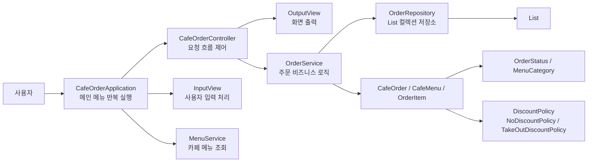
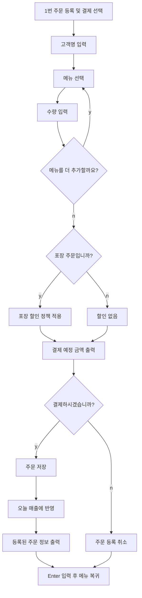

# Java 21 기반 카페 주문 데이터 연동 및 가상 스레드 실행 추적 프로젝트

기존 **Cafe Management System**을 기반으로 JDBC/MySQL 데이터 연동을 적용하고,
Java 21 가상 스레드를 주문 처리 과정의 I/O 대기 구간과 연결해 실험하는 백엔드 프로젝트입니다.

Java 21 가상 스레드를 단순 실행 예제로 사용한 것이 아니라,
JDBC/MySQL 주문 처리 과정에서 스레드 이름, 작업 시작 시점, 대기 시작/종료 시점,
전체 실행 시간을 기록하여 I/O 중심 백엔드 작업의 실행 흐름을 확인하는 데 초점을 두었습니다.

본 프로젝트에서는 새로운 CRUD를 처음부터 다시 만드는 대신,
이미 개발한 카페 주문 관리 시스템을 재사용하여 Java 구조를 복습하고,
DB 연동과 Java 21 가상 스레드 실험에 집중합니다.

## AI 협업 방식

AI를 단순 결과물 생성 도구가 아니라,
요구사항 정리, 설계 초안 작성, 코드 검토, 문서 보완을 빠르게 반복하기 위한 협업 도구로 활용했습니다.

최종 방향과 반영 여부는 직접 판단했으며,
이해하지 못한 코드나 설명은 프로젝트에 포함하지 않는 것을 원칙으로 했습니다.

---

## 1. 프로젝트 주제

기존 카페 주문 관리 시스템을 기반으로 한 Java 21 백엔드 데이터 연동 및 가상 스레드 실행 추적 프로젝트입니다.

주요 관리 대상은 `CafeOrder`이며, 하나의 주문에는 고객명, 주문 메뉴, 수량, 포장 여부에 따른 할인 정책, 주문 상태, 결제 금액, 주문 시간이 포함됩니다.

기본 주문 CRUD는 JDBC/MySQL 기반으로 전환하고,
Java 21 가상 스레드 실험에서는 여러 주문 처리 작업의 시작 시점, DB I/O 대기 구간, 종료 시점을 실행 추적 로그로 기록합니다.

---

## 2. 콘솔 메뉴

```text
1. 주문 등록 및 결제
2. 전체 주문 조회
3. 주문번호로 조회
4. 고객명으로 검색
5. 메뉴명으로 검색
6. 주문 상태로 필터
7. 주문 수정
8. 주문 삭제
9. 오늘 매출 조회
0. 프로그램 종료
```

---

## 3. 프로그램 전체 설계도



### 설계 의도

- `view`는 입력과 출력만 담당합니다.
- `controller`는 사용자의 요청을 서비스에 연결합니다.
- `service`는 주문 등록, 조회, 수정, 삭제, 검색, 매출 계산 같은 핵심 로직을 담당합니다.
- `repository`는 여러 주문을 `List` 컬렉션에 저장합니다.
- `model`은 주문, 메뉴, 주문 항목, 상태, 할인 정책을 표현합니다.

---

## 4. 주문 등록 및 결제 흐름



---

## 5. CRUD 구현 위치

| CRUD | 메뉴 | 구현 위치 | 설명 |
| --- | --- | --- | --- |
| Create | 1. 주문 등록 및 결제 | `CafeOrderApplication.handleRegisterOrder()`, `OrderService.createOrder()` | 고객명, 메뉴, 수량, 할인 정책을 입력받아 새 주문을 저장합니다. |
| Read | 2. 전체 주문 조회 | `CafeOrderController.showAllOrders()`, `OrderService.findAll()` | 저장된 모든 주문을 조회합니다. |
| Read | 3. 주문번호로 조회 | `CafeOrderController.showOrderById()`, `OrderService.findById()` | 주문번호로 특정 주문 1건을 조회합니다. |
| Read | 4~6. 검색/필터 | `OrderService.searchByCustomerName()`, `searchByMenuName()`, `filterByStatus()` | Stream API를 사용해 조건에 맞는 주문을 찾습니다. |
| Update | 7. 주문 수정 | `CafeOrderApplication.handleUpdateOrder()`, `OrderService.updateCustomerName()`, `updateOrderStatus()` | 고객명 또는 주문 상태를 수정합니다. |
| Delete | 8. 주문 삭제 | `CafeOrderController.deleteOrder()`, `OrderService.deleteOrder()` | 주문번호로 주문을 찾아 삭제합니다. |

---

## 6. 필수 요구사항 반영표

| 번호 | 필수 요구사항 | 반영 위치 | 구현 설명 |
| --- | --- | --- | --- |
| 1 | 콘솔 메뉴가 반복해서 나타나고, 종료 메뉴를 고르면 정상 종료된다 | `CafeOrderApplication.run()` | `while (running)` 반복문으로 메뉴를 계속 출력하고, `0` 입력 시 `running = false`로 종료합니다. |
| 2 | 데이터를 표현하는 모델 클래스가 1개 이상 있다 | `CafeOrder`, `CafeMenu`, `OrderItem` | 필드는 `private`으로 선언하고 getter, 변경 메소드로 접근합니다. |
| 3 | 여러 건의 데이터를 컬렉션에 담아 관리한다 | `OrderRepository` | `private final List<CafeOrder> orders = new ArrayList<>();`로 여러 주문을 저장합니다. |
| 4 | 메인 주제의 CRUD가 모두 동작한다 | `OrderService`, `CafeOrderController` | 주문 등록, 조회, 수정, 삭제 기능을 모두 제공합니다. |
| 5 | 정해진 값 중 하나를 고르는 항목을 enum으로 만든다 | `OrderStatus`, `MenuCategory` | 주문 상태와 메뉴 분류를 enum으로 제한하여 잘못된 상태값을 줄입니다. |
| 6 | Stream API를 사용한 검색·필터 기능이 2개 이상 있다 | `OrderService` | 고객명 검색, 메뉴명 검색, 주문 상태 필터, 오늘 매출 계산에 Stream API를 사용합니다. |
| 7 | 클래스를 역할별로 나눈다 | `view`, `controller`, `service`, `repository`, `model`, `exception` 패키지 | 화면 출력과 데이터 처리 로직을 분리하여 관심사의 분리를 적용했습니다. |
| 8 | 사용자가 잘못 입력해도 프로그램이 종료되지 않는다 | `InputView`, `OrderNotFoundException`, `try-catch` | 숫자가 아닌 입력, 없는 주문번호, 잘못된 메뉴 선택 등이 들어와도 안내 메시지를 출력하고 다시 흐름을 이어갑니다. |

---

## 7. 필수 요구사항 상세 구현 설명

### 1. 반복 콘솔 메뉴와 정상 종료

이 프로그램은 한 번 실행하고 끝나는 프로그램이 아니라, 사용자가 여러 작업을 계속 수행할 수 있는 관리 프로그램입니다.

그래서 `CafeOrderApplication.run()` 메소드에서 `while (running)` 반복문을 사용했습니다.

```text
메뉴 출력
-> 사용자 메뉴 번호 입력
-> 선택한 기능 실행
-> 실행 결과 확인
-> 다시 메뉴 출력
```

사용자가 `0. 프로그램 종료`를 선택하면 `running` 값을 `false`로 바꾸어 반복문을 종료합니다.

이 구조 덕분에 사용자는 주문을 등록한 뒤 바로 조회하거나, 수정하거나, 매출을 확인하는 작업을 이어서 할 수 있습니다.

또한 각 기능이 끝난 뒤 바로 메뉴가 다시 올라오면 결과를 읽기 어려웠기 때문에 `InputView.waitForEnter()`를 사용해 사용자가 결과를 확인한 뒤 다음 메뉴로 넘어가도록 만들었습니다.

### 2. 데이터를 표현하는 모델 클래스

카페 주문 프로그램에서 관리해야 하는 데이터는 단순 문자열 하나가 아닙니다.

주문에는 고객명, 주문한 메뉴 목록, 수량, 주문 상태, 할인 정책, 주문 시간이 함께 필요합니다.

그래서 데이터를 역할별 모델 클래스로 나누었습니다.

```text
CafeOrder  : 주문 1건 전체를 표현
CafeMenu   : 판매 메뉴 1개를 표현
OrderItem  : 주문 안에 들어간 메뉴와 수량을 표현
```

예를 들어 고객이 `아메리카노 2잔`과 `치즈케이크 1개`를 주문하면, `CafeOrder` 안에는 여러 개의 `OrderItem`이 들어갑니다.

필드는 모두 `private`으로 선언했습니다. 외부에서 값을 마음대로 바꾸지 못하게 하고, 필요한 경우 getter나 `changeCustomerName()`, `changeStatus()` 같은 메소드를 통해서만 바꾸도록 했습니다.

이렇게 한 이유는 객체의 데이터가 아무 곳에서나 수정되면 프로그램의 흐름을 추적하기 어려워지기 때문입니다.

### 3. 컬렉션을 사용한 여러 데이터 관리

카페 주문은 한 건만 저장되는 것이 아니라, 프로그램 실행 중 여러 건이 계속 쌓입니다.

그래서 `OrderRepository`에서 `List<CafeOrder>` 컬렉션을 사용했습니다.

```java
private final List<CafeOrder> orders = new ArrayList<>();
```

이 리스트는 간단한 데이터베이스 역할을 합니다.

실제 실무에서는 DB에 저장하겠지만, 이번 과제는 Java 컬렉션 학습이 목적이기 때문에 `ArrayList`를 사용해 주문들을 메모리에 저장했습니다.

주문이 등록되면 리스트에 추가되고, 전체 조회를 하면 리스트에 있는 모든 주문을 반환합니다. 주문 삭제를 하면 리스트에서 해당 주문을 제거합니다.

### 4. CRUD 전체 구현

CRUD는 데이터를 다루는 프로그램의 기본 기능입니다.

이 프로그램에서는 주문을 기준으로 CRUD를 구현했습니다.

```text
Create : 주문 등록 및 결제
Read   : 전체 조회, 주문번호 조회, 고객명 검색, 메뉴명 검색, 상태 필터
Update : 고객명 수정, 주문 상태 수정
Delete : 주문 삭제
```

`CafeOrderApplication`은 사용자의 메뉴 선택을 받고, `CafeOrderController`는 선택된 요청을 `OrderService`로 전달합니다.

실제 데이터 처리 로직은 `OrderService`에 모았습니다.

예를 들어 주문 등록은 다음 흐름으로 진행됩니다.

```text
사용자 입력 수집
-> OrderItem 목록 생성
-> 할인 정책 선택
-> 결제 확인
-> OrderService.createOrder()
-> OrderRepository.save()
```

이렇게 나눈 이유는 화면 입력 코드와 주문 처리 코드를 섞지 않기 위해서입니다.

### 5. enum을 사용한 정해진 값 관리

주문 상태나 메뉴 분류는 아무 문자열이나 들어가면 안 됩니다.

예를 들어 주문 상태가 `대기`, `준비중`, `완료`, `끝`, `취소됨`처럼 제각각 입력되면 검색과 필터링이 어려워집니다.

그래서 `OrderStatus` enum으로 주문 상태를 정해진 값으로 제한했습니다.

```text
WAITING   : 접수 대기
MAKING    : 제조 중
READY     : 준비 완료
COMPLETED : 수령 완료
CANCELED  : 취소
```

메뉴 분류도 `MenuCategory` enum으로 관리했습니다.

```text
COFFEE
BEVERAGE
DESSERT
```

enum을 사용하면 오타를 줄일 수 있고, 상태 필터 기능에서도 `OrderStatus` 값을 기준으로 안정적으로 비교할 수 있습니다.

### 6. 람다와 Stream API 검색·필터 기능

주문 목록에서 조건에 맞는 데이터만 찾기 위해 Stream API를 사용했습니다.

대표 기능은 다음과 같습니다.

```text
고객명 검색
메뉴명 검색
주문 상태 필터
오늘 매출 계산
```

예를 들어 고객명 검색은 주문 리스트를 stream으로 흐르게 만든 뒤, 고객명에 검색어가 포함된 주문만 `filter`로 골라냅니다.

메뉴명 검색은 주문 안의 여러 `OrderItem` 중 하나라도 검색어를 포함하는지 확인합니다.

오늘 매출 계산에서는 `CANCELED` 상태가 아닌 주문만 골라서 최종 결제 금액을 합산합니다.

이렇게 Stream API를 사용하면 반복문을 직접 길게 작성하는 대신, `filter`, `mapToInt`, `sum`, `toList` 같은 기능으로 검색과 계산 의도를 더 명확하게 표현할 수 있습니다.

### 7. 역할별 클래스 분리

처음부터 모든 코드를 `main()` 메소드 하나에 넣으면 작게는 동작할 수 있지만, 기능이 늘어날수록 읽기 어렵고 수정하기 어려워집니다.

그래서 패키지와 클래스를 역할별로 나누었습니다.

```text
view       : 사용자 입력과 화면 출력
controller : 사용자 요청 흐름 제어
service    : 주문과 메뉴의 핵심 처리 로직
repository : 주문 데이터를 컬렉션에 저장
model      : 주문, 메뉴, 상태, 할인 정책 표현
exception  : 주문을 찾지 못했을 때의 예외 표현
```

예를 들어 `InputView`는 숫자 입력, 문자열 입력, y/n 입력만 담당합니다. `OrderService`는 화면 출력에 대해 알 필요 없이 주문 생성, 검색, 수정, 삭제만 담당합니다.

이렇게 나누면 나중에 콘솔 화면을 웹 화면으로 바꾸더라도, 주문 처리 로직은 비교적 그대로 유지할 수 있습니다.

### 8. 잘못된 입력에 대한 예외 처리

사용자가 항상 올바른 값만 입력한다고 가정하면 프로그램이 쉽게 종료될 수 있습니다.

예를 들어 메뉴 번호를 입력해야 하는 곳에 `abc`를 입력하면 `NumberFormatException`이 발생할 수 있습니다.

그래서 `InputView.readInt()`에서 숫자 변환을 `try-catch`로 감싸고, 잘못 입력하면 에러 메시지를 보여준 뒤 다시 입력받도록 했습니다.

존재하지 않는 주문번호를 조회하거나 삭제하려고 할 때는 `OrderNotFoundException`을 사용했습니다.

이 예외는 프로그램을 바로 종료시키기 위한 것이 아니라, 문제가 무엇인지 사용자에게 알려주고 다시 메뉴 흐름으로 돌아가기 위한 장치입니다.

즉, 예외 처리는 단순히 오류를 숨기는 것이 아니라 사용자가 실수해도 프로그램이 안정적으로 계속 동작하게 만드는 역할을 합니다.

---

## 8. Java 문법 활용 요약

| Java 개념 | 사용 위치 | 설명 |
| --- | --- | --- |
| 클래스와 객체 | `CafeOrder`, `CafeMenu`, `OrderItem` | 현실의 주문, 메뉴, 주문 항목을 객체로 표현했습니다. |
| 캡슐화 | 모델 클래스의 `private` 필드 | 필드를 직접 수정하지 못하게 하고 메소드를 통해 접근합니다. |
| 상속/다형성 | `DiscountPolicy` 인터페이스 | `NoDiscountPolicy`, `TakeOutDiscountPolicy`가 같은 인터페이스를 구현합니다. |
| 컬렉션 | `List<CafeOrder>`, `List<OrderItem>` | 여러 주문과 여러 주문 항목을 저장합니다. |
| 예외 처리 | `InputView`, `OrderNotFoundException` | 잘못된 입력에도 프로그램이 종료되지 않도록 처리합니다. |
| enum | `OrderStatus`, `MenuCategory` | 주문 상태와 메뉴 분류를 정해진 값으로 관리합니다. |
| 람다/Stream API | `OrderService` 검색 메소드 | `filter`, `map`, `sum`, `toList`를 사용해 검색과 계산을 처리합니다. |

---

## 9. 주요 클래스 역할

| 클래스 | 역할 |
| --- | --- |
| `CafeOrderApplication` | 프로그램 시작점, 반복 메뉴 실행, 사용자 입력 흐름 처리 |
| `CafeOrderController` | 사용자의 요청을 서비스로 전달하고 결과를 출력 |
| `InputView` | 숫자, 문자열, y/n 입력 처리 및 예외 입력 방어 |
| `OutputView` | 메뉴, 주문 목록, 에러 메시지, 매출 요약 출력 |
| `MenuService` | 카페 메뉴 목록 제공 및 메뉴 번호 조회 |
| `OrderService` | 주문 등록, 조회, 검색, 수정, 삭제, 매출 계산 |
| `OrderRepository` | `List<CafeOrder>` 컬렉션을 사용한 주문 저장소 |
| `CafeOrder` | 주문번호, 고객명, 주문 항목, 상태, 할인, 주문 시간 관리 |
| `CafeMenu` | 메뉴번호, 메뉴명, 카테고리, 가격 관리 |
| `OrderItem` | 주문한 메뉴와 수량 관리 |
| `OrderStatus` | 접수 대기, 제조 중, 준비 완료, 수령 완료, 취소 상태 관리 |
| `MenuCategory` | 커피, 음료, 디저트 메뉴 분류 |
| `DiscountPolicy` | 할인 정책 다형성 적용 |

---

## 10. 예외 처리 예시

사용자가 숫자를 입력해야 하는 곳에 문자를 입력해도 프로그램이 종료되지 않습니다.

```text
메뉴 선택: abc
[오류] 숫자를 입력해주세요.
메뉴 선택:
```

존재하지 않는 주문번호를 입력해도 프로그램은 종료되지 않고 에러 메시지를 출력합니다.

```text
주문번호 입력: 999
[오류] 999번 주문을 찾을 수 없습니다.
계속하려면 Enter를 누르세요...
```

---

## 11. 제출용 요약

이 프로젝트는 카페 주문을 주제로 한 Java 21 콘솔 프로그램입니다.

필수 요구사항인 반복 메뉴, 모델 클래스, 컬렉션, CRUD, enum, Stream API, 역할 분리, 예외 처리를 모두 포함했습니다.

또한 할인 정책을 인터페이스로 분리하여 상속/다형성 개념도 함께 적용했습니다.
