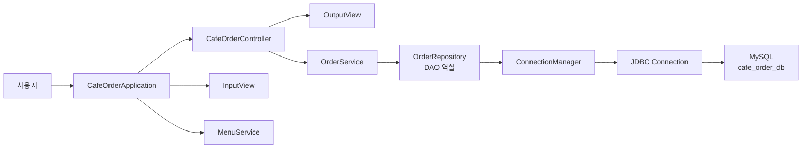
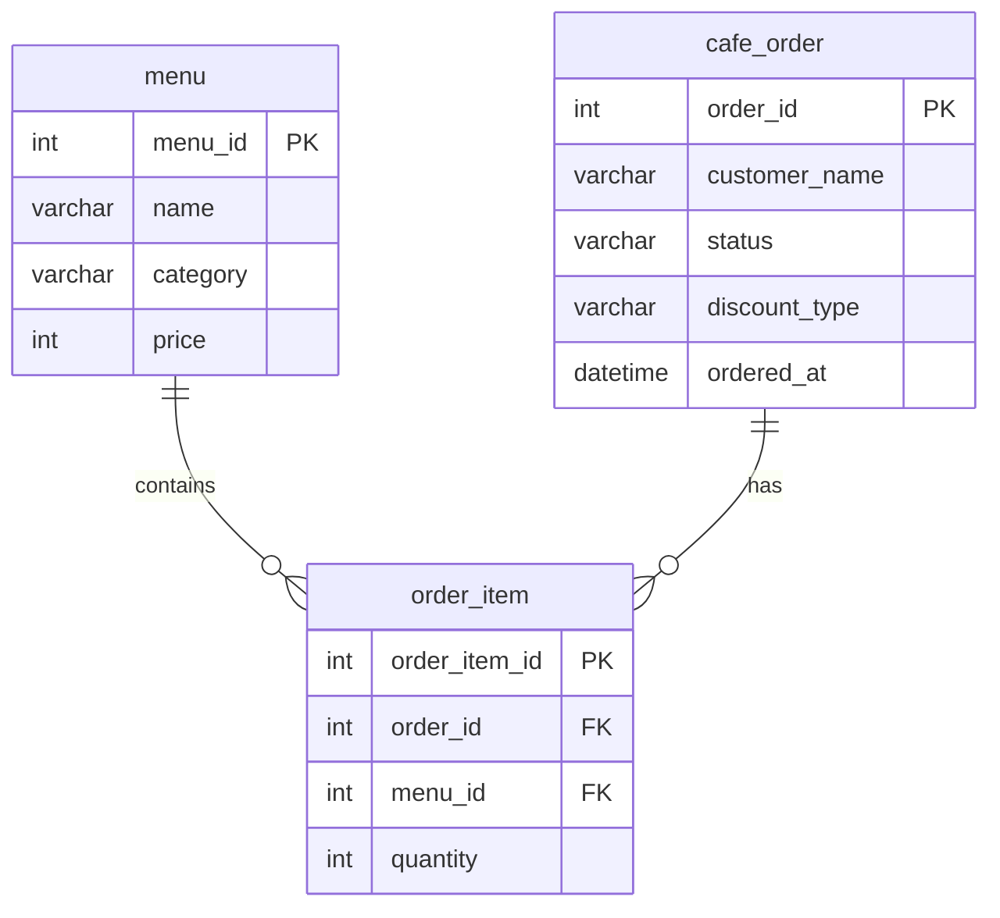

# Java 21 JDBC 카페 주문 데이터 연동 프로젝트 설계서

## 1. 프로젝트 정의

이 프로젝트는 기존 `cafe-order-management-system`을 기반으로, 메모리 컬렉션에 저장하던 카페 주문 데이터를 MySQL 데이터베이스에 저장하도록 확장하는 미니 프로젝트입니다.

기존 프로젝트는 `List<CafeOrder>`를 사용해 주문 데이터를 관리했습니다. 이번 JDBC 연동 프로젝트에서는 같은 CRUD 기능을 유지하되, 주문 데이터가 프로그램 종료 후에도 사라지지 않도록 MySQL에 영구 저장합니다.

프로젝트 주제는 다음과 같이 정의합니다.

```text
Java 21 기반 AI 카페 주문 데이터 연동 시스템
```

부제는 다음과 같습니다.

```text
JDBC와 MySQL을 활용한 Cafe Management CRUD 및 AI 서비스 확장형 백엔드 설계
```

## 2. Java 21 선택 이유

본 프로젝트는 학습 범위를 벗어난 기술 과시가 아니라, Java 21 LTS 기반에서 JDBC, DAO/DTO, MySQL CRUD라는 수업 핵심 요구사항을 충실히 구현한 프로젝트입니다.

Java 21은 장기 지원 버전이며, 향후 AI 서비스 서버로 확장될 경우 외부 API 호출, DB I/O, 다중 요청 처리와 같은 I/O 중심 작업이 많아질 수 있습니다. 따라서 본 프로젝트에서는 Java 21의 가상 스레드와 현대 Java 문법을 고려하여 확장 가능한 백엔드 구조를 설계했습니다.

발표용 핵심 문장은 다음과 같습니다.

```text
수업의 핵심 요구사항인 JDBC, DAO/DTO, MySQL CRUD는 정석적으로 구현했습니다.
Java 21은 그 위에서 향후 AI 서버 확장성을 고려한 기술 선택입니다.
```

## 3. 현재 구조와 변경 방향

현재 프로젝트 구조는 이미 역할별로 분리되어 있습니다.

```text
view       : 사용자 입력과 화면 출력
controller : 사용자 요청 흐름 제어
service    : 주문 비즈니스 로직
repository : List 기반 주문 저장소
model      : 주문, 메뉴, 주문 항목, 상태, 할인 정책
exception  : 예외 클래스
```

JDBC 프로젝트에서는 `repository`의 저장 방식을 DB 기반 DAO로 전환합니다.

```text
기존 방식:
OrderRepository -> List<CafeOrder>

변경 방식:
OrderRepository(DAO 역할) -> JDBC / ConnectionManager -> MySQL
```

즉, 화면과 서비스 흐름 전체를 다시 만드는 것이 아니라 데이터 저장 계층을 MySQL 기반으로 바꾸는 것이 핵심입니다.

## 4. 전체 아키텍처



## 5. DB 설계 개요

DB는 다음 3개 테이블로 시작합니다.

| 테이블 | 역할 |
| --- | --- |
| `menu` | 판매 메뉴 마스터 데이터 |
| `cafe_order` | 주문 1건의 기본 정보 |
| `order_item` | 주문 안에 포함된 메뉴와 수량 |

한 주문에는 여러 메뉴가 들어갈 수 있습니다. 그래서 `cafe_order`와 `order_item`은 1:N 관계입니다.

메뉴는 여러 주문 항목에서 참조될 수 있습니다. 그래서 `menu`와 `order_item`도 1:N 관계입니다.



## 6. 테이블 설계 이유

### menu

`menu` 테이블은 카페에서 판매하는 메뉴 정보를 저장합니다.

기존 Java 코드의 `CafeMenu`와 대응됩니다.

| Java 필드 | DB 컬럼 |
| --- | --- |
| `id` | `menu_id` |
| `name` | `name` |
| `category` | `category` |
| `price` | `price` |

메뉴를 DB에 저장하면 Java 코드에 메뉴 목록을 하드코딩하지 않아도 됩니다.

### cafe_order

`cafe_order` 테이블은 주문 한 건의 대표 정보를 저장합니다.

기존 Java 코드의 `CafeOrder`와 대응됩니다.

| Java 필드 | DB 컬럼 |
| --- | --- |
| `id` | `order_id` |
| `customerName` | `customer_name` |
| `status` | `status` |
| `discountPolicy` | `discount_type` |
| `orderedAt` | `ordered_at` |

주문 금액은 DB에 저장하지 않고 메뉴 가격과 수량으로 계산할 수 있습니다. 다만 실무에서는 결제 당시 가격 보존을 위해 주문 항목에 단가를 함께 저장하기도 합니다. 이번 학습 프로젝트에서는 구조를 단순하게 유지하기 위해 `menu.price`를 기준으로 계산합니다.

### order_item

`order_item` 테이블은 한 주문 안에 들어간 메뉴와 수량을 저장합니다.

기존 Java 코드의 `OrderItem`과 대응됩니다.

| Java 필드 | DB 컬럼 |
| --- | --- |
| `menu` | `menu_id` |
| `quantity` | `quantity` |

주문 하나에 아메리카노 2잔, 치즈케이크 1개처럼 여러 항목이 들어갈 수 있으므로 별도 테이블로 분리합니다.

## 7. DAO/DTO 설계

DAO는 SQL을 실행하는 클래스입니다.

DTO는 DB 데이터와 Java 객체 사이에서 데이터를 운반하는 객체입니다.

이 프로젝트에서는 기존 `model` 클래스가 이미 DTO와 비슷한 역할을 합니다. 따라서 초반 구현에서는 기존 모델을 재사용하고, 필요하면 DB 전용 DTO를 추가합니다.

현재 구현 구조는 다음과 같습니다.

| 클래스 | 역할 |
| --- | --- |
| `OrderRepository` | DAO 역할. 주문 등록, 조회, 수정, 삭제 SQL 실행 |
| `ConnectionManager` | DB 연결 생성 위치 분리 |
| `CafeOrder` | 주문 한 건을 전달하는 DTO/Model 역할 |
| `OrderItem` | 주문 상세 데이터를 전달하는 DTO/Model 역할 |
| `CafeMenu` | 메뉴 데이터를 전달하는 DTO/Model 역할 |

기존 프로젝트에서 이미 `OrderRepository`라는 이름으로 저장소 역할이 분리되어 있었기 때문에, 클래스 이름을 `OrderDAO`로 바꾸지 않고 기존 이름을 유지한다.

다만 내부 구현은 `ArrayList` 저장 방식에서 JDBC/MySQL 접근 방식으로 변경했으므로 실제 역할은 DAO에 해당한다.

패키지 구조는 다음과 같이 확장한다.

```text
com.assignment.cafe
├─ db
│  └─ ConnectionManager
├─ repository
│  └─ OrderRepository
├─ model
├─ service
├─ controller
└─ view
```

## 8. CRUD 구현 계획

| CRUD | 콘솔 기능 | SQL |
| --- | --- | --- |
| Create | 주문 등록 | `INSERT INTO cafe_order`, `INSERT INTO order_item` |
| Read | 전체 주문 조회 | `SELECT` + `JOIN` |
| Read | 주문 번호 조회 | `SELECT` + `WHERE order_id = ?` |
| Read | 고객명 검색 | `SELECT` + `WHERE customer_name LIKE ?` |
| Read | 메뉴명 검색 | `SELECT` + `JOIN menu` + `WHERE menu.name LIKE ?` |
| Read | 상태 필터 | `SELECT` + `WHERE status = ?` |
| Update | 고객명 수정 | `UPDATE cafe_order SET customer_name = ?` |
| Update | 주문 상태 수정 | `UPDATE cafe_order SET status = ?` |
| Delete | 주문 삭제 | `DELETE FROM cafe_order WHERE order_id = ?` |

주문 등록은 한 번에 두 테이블에 저장해야 합니다.

```text
1. cafe_order에 주문 기본 정보 INSERT
2. 생성된 order_id 조회
3. order_item에 주문 항목 여러 건 INSERT
```

이 과정 중 하나라도 실패하면 전체 주문 저장을 취소해야 하므로 트랜잭션을 적용합니다.

```text
setAutoCommit(false)
-> 주문 INSERT
-> 주문 항목 INSERT
-> commit()
-> 실패 시 rollback()
```

## 9. Connection 관리와 자원 반환

수업 요구사항에는 Connection 객체 관리와 자원 반환이 포함되어 있다.

이번 프로젝트에서는 Connection Pool 라이브러리를 바로 적용하기보다, JDBC의 기본 연결 흐름을 직접 이해하는 것을 우선했다.

따라서 현재 구현 범위는 다음과 같다.

1. `ConnectionManager`에서 `DriverManager.getConnection()`으로 JDBC 연결을 생성한다.
2. `OrderRepository`는 `ConnectionManager.getConnection()`을 통해 DB 연결을 얻는다.
3. `try-with-resources`를 사용해 `Connection`, `PreparedStatement`, `ResultSet`을 자동 반환한다.
4. 주문 저장처럼 여러 SQL이 함께 성공해야 하는 작업에는 트랜잭션을 적용한다.

현재 구현에서는 HikariCP 같은 Connection Pool 라이브러리를 직접 적용하지 않았다.

Connection Pool은 미리 만들어 둔 DB 연결을 빌려주고 회수하는 구조이며, 실무에서는 성능과 안정성을 위해 자주 사용된다. 하지만 이번 단계에서는 `DriverManager` 방식으로 Connection 생성 위치를 분리하고, JDBC 자원 반환을 명확히 처리하는 데 집중했다.

이렇게 정리한 이유는 다음과 같다.

1. 현재 프로젝트는 콘솔 기반 미니 프로젝트이므로 Connection Pool 적용보다 JDBC 기본 구조 이해가 우선이다.
2. `ConnectionManager`로 DB 연결 생성 위치를 분리해 두면 이후 HikariCP로 교체하기 쉽다.
3. 이해하지 못한 라이브러리 설정을 억지로 넣기보다, 직접 설명 가능한 범위에서 구현하는 것이 프로젝트 원칙에 맞다.

현재 구현의 핵심은 다음과 같다.

```text
ConnectionManager
-> DriverManager.getConnection()
-> OrderRepository에서 SQL 실행
-> try-with-resources로 JDBC 자원 자동 반환
-> 필요 시 commit 또는 rollback
```

향후 Spring Boot 또는 더 큰 백엔드 프로젝트로 확장할 경우에는 `ConnectionManager` 내부 구현을 HikariCP 기반 Connection Pool로 바꿀 수 있다. 이때 서비스와 저장소의 전체 구조는 유지하고, DB 연결을 생성하는 방식만 교체하는 방향으로 확장한다.

## 10. AI 서비스 확장 관점

현재 기능은 카페 주문 CRUD입니다.

하지만 DB에 주문 데이터가 쌓이면 향후 다음 AI 기능으로 확장할 수 있습니다.

| 확장 기능 | 사용할 데이터 |
| --- | --- |
| 인기 메뉴 추천 | `order_item`, `menu` |
| 고객별 주문 패턴 분석 | `cafe_order.customer_name`, `order_item` |
| 시간대별 매출 분석 | `cafe_order.ordered_at` |
| AI 챗봇 주문 보조 | `menu`, `cafe_order` |
| 재고 예측 | 메뉴별 주문 수량 |

따라서 이번 DB 설계는 단순 CRUD뿐 아니라 AI 서비스로 확장 가능한 데이터 기반을 만드는 단계입니다.

## 11. 개발 순서

오늘 설계 커밋 이후 구현은 다음 순서로 진행합니다.

1. `sql/schema.sql` 작성
2. Gradle에 MySQL Connector 의존성 추가
3. `ConnectionManager` 구현
4. `OrderRepository`를 DAO 역할로 전환
5. 주문 등록 트랜잭션 적용
6. 전체 조회와 단건 조회 구현
7. 수정, 삭제 구현
8. JDBC CRUD 실제 실행 테스트
9. Java 21 가상 스레드 실험 구현
10. README, Notion, 발표 자료 정리

## 12. 발표 방어 포인트

### Java 21을 선택한 이유

Java 21은 LTS 버전이며, 향후 AI 서비스 서버로 확장할 때 가상 스레드를 활용할 수 있습니다. 본 프로젝트에서는 수업 핵심 요구사항인 JDBC, DAO/DTO, MySQL CRUD를 우선 구현하고, Java 21은 확장성을 고려한 기술 선택으로 사용합니다.

### 가상 스레드가 현재 CRUD에 필수인가?

현재 콘솔 CRUD에는 필수는 아닙니다. 하지만 AI API 호출, DB I/O, 다중 사용자 요청이 늘어나는 서버 구조에서는 I/O 중심 작업이 많아지므로 Java 21의 가상 스레드가 적합합니다. 따라서 기본 CRUD는 JDBC 정석 구조로 구현하고, 확장 방향에서 가상 스레드를 설명합니다.

### Codex를 사용한 이유

Codex는 개발 도구로 사용합니다. 요구사항 분석, DB 구조 결정, 코드 실행, 오류 수정, 문서화 방향 결정은 개발자가 직접 검토하고 수행합니다. AI를 사용했다는 점보다 AI를 개발 과정에 어떻게 통제하며 활용했는지가 중요합니다.
